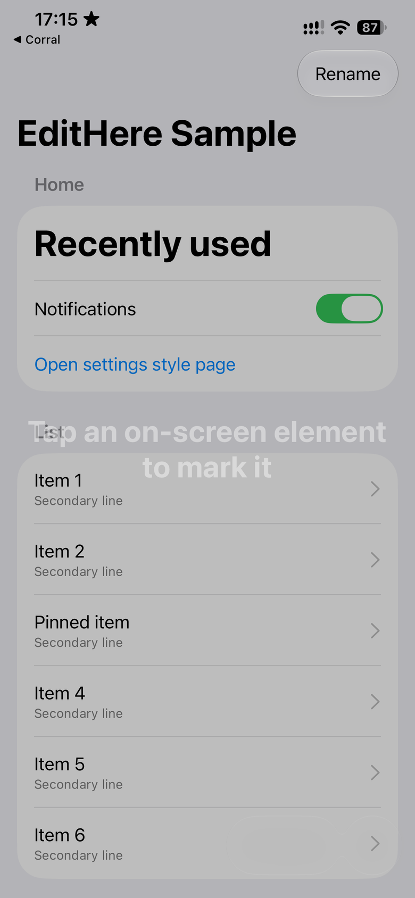
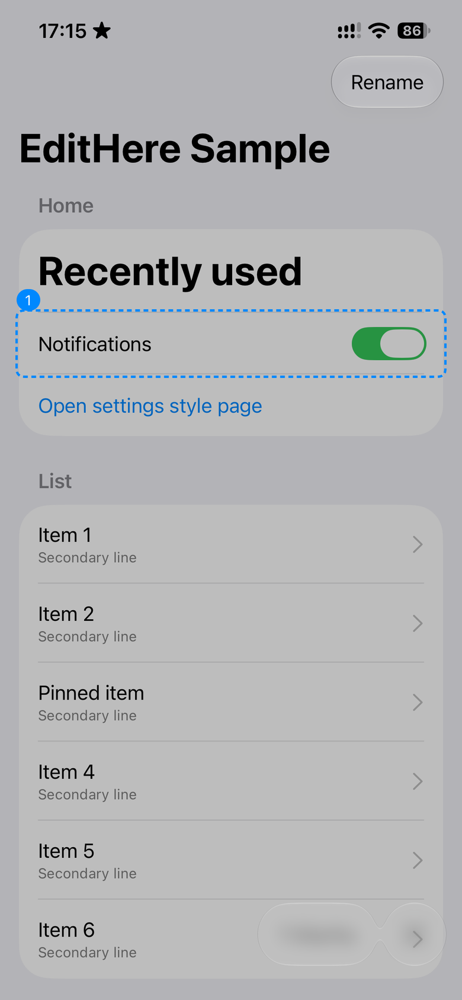

**语言：** [English](README.md) | 简体中文

# EditHere

在真机运行中的 iOS 应用上直接标注界面，写清要改什么，导出带编号的截图和对应提示词，交给编程助手处理。

应用入口安装一次即可。运行时点选控件，攒一批后提交。不需要 Corral 账号——默认的本地文件导出就能用。

[](LICENSE)
[](#支持的平台)
[](Package.swift)

<p align="center">
  
  &nbsp;
  
</p>

<p align="center"><em>在冻结页上点选可见控件。编号与修改说明一一对应。</em></p>

## 功能

- **点选标记** — 选中控件范围；同一位置再点可扩大到父级
- **跨页攒批** — 关闭后继续用 App，再打开 EditHere 继续收集
- **整页编号截图** — 证据保留完整可见页，不只是裁切小图
- **可交给助手** — 标注图、`manifest.json`、`agent-prompt.txt`
- **可插拔去向** — 默认文件导出；可选本机接收端投递给命名执行器

## 支持的平台

| 平台 | 支持 |
|---|---|
| iOS 17+ | 是（Swift Package） |
| iPadOS 17+ | 是（同一包） |
| macOS / Linux / Windows | 不适用——这是原生 iOS SDK |

## 安装

在 Xcode：**File → Add Package Dependencies…**，添加：

```text
https://github.com/x0c/EditHere
```

把下列产品链到你的 App target：

- `EditHere` — 浮层与会话
- `EditHereFileDestination` — 导出到 Documents（建议先从这个开始）
- `EditHereLocalHostDestination` — 可选，开发机 HTTP 接收端

或在 `Package.swift`：

```swift
.package(url: "https://github.com/x0c/EditHere.git", from: "0.1.0")
```

## 快速开始

```swift
import EditHere
import EditHereFileDestination

#if DEBUG
let destination = try EditHereFileDestination.documentsDestination()
let configuration = EditHereConfiguration(destination: destination)
_ = try await EditHereInstaller.install(configuration: configuration)
#endif
```

SwiftUI：

```swift
ContentView()
    .installEditHere(configuration: configuration)
```

用 `#if DEBUG`（或内部开关）包住安装，避免正式上架包默认露出浮动入口——除非产品明确要这么做。

### 第一次怎么用

1. 点 **Edit**
2. 点一个控件（同一位置再点会扩大到父级）
3. 输入修改说明或用 Quick Actions，再 **Done** 继续标
4. **Close** 回去用 App；再点浮动按钮可标下一屏
5. 打开 **Marks** → **Submit · N** 导出整批

### 你会得到什么

使用 `EditHereFileDestination` 时，Submit 会在 App 的 Documents 下写出类似：

```text
EditHereExport/
  agent-prompt.txt
  manifest.json
  assets/
    page-annotated.png
```

把整个文件夹（或提示词 + 图片）交给编程助手即可。文件导出不会自动改代码；自动执行需要另接执行去向。

## 示例 App

```bash
cd Examples/EditHereSample
xcodegen generate
open EditHereSample.xcodeproj
```

有真机时请在真机上跑。项目侧接收端配置见 [docs/INTEGRATION_GUIDE.md](docs/INTEGRATION_GUIDE.md)。

## 文档

- [接入指南](docs/INTEGRATION_GUIDE.md)
- [产品规则](docs/PRODUCT_KNOWLEDGE_BASE.md)
- [助手提示词设计](docs/design/AGENT_PROMPT_CORE_DESIGN.md)
- [架构边界](docs/design/ARCHITECTURE_BOUNDS.md)

## 对标说明

门面结构参考了更高关注度的视觉反馈工具（[Agentation](https://github.com/benjitaylor/agentation)、[Sampler](https://github.com/gabrieltmitchell/sampler)）：安装路径短、真机截图、明确导出清单。EditHere 不声称网页选择器、MCP 自动派工，也不声称文件导出能自动改源码。

## 许可证

MIT
