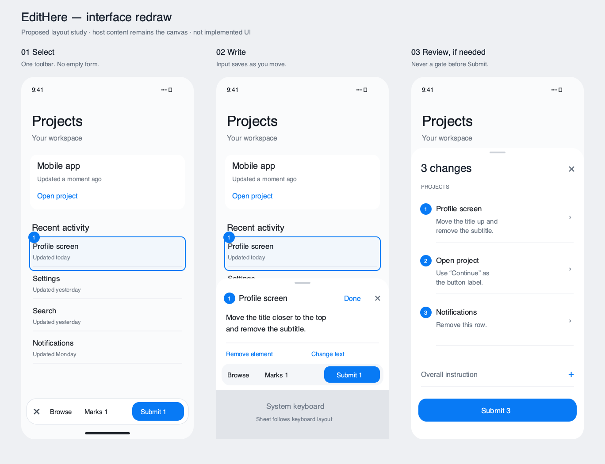

# EditHere implementation review and UI redesign

Status: **pre-implementation review record**; **§5 custom layout aesthetic superseded** by `2026-09-12-NATIVE_UI_REVISION.md` (2026-09-12 user correction). **Browse as a required chrome control superseded** by `docs/PRODUCT_KNOWLEDGE_BASE.md` (Close returns to the app; tap the floating entry for the next screen). The later implementation uses a system toolbar and a compact no-arrow popover composer; keep interaction and P1 findings, but do not rebuild hand-drawn toolbar/sheet containers from §5 or `ui-layout-study.png`.

Date: 2026-09-12. Scope: review and design only. No product source changes were made by this historical review; subsequent implementation and device evidence are recorded in `docs/PRODUCT_KNOWLEDGE_BASE.md`.

## 1. Read this first

**Recommendation: retain the independent package structure, repair evidence and submission correctness, redesign the annotation interaction, and only then connect a real execution destination.** The current work is a useful prototype, not a verified direct-edit tool. Do not implement the Corral plan unchanged.

The user explicitly requests that this review, including the visual redesign, be delivered as a temporary document for another Agent to implement. This file is that handoff; its proposed solutions are recommendations, not claims that implementation or acceptance has happened. Before implementation, bring accepted product requirements into the product's reachable documentation and update the old adapter plan. Do not silently treat the old plan's “approved” label as overriding the user's later independence requirement or the evidence below.

### Confirmed user requirements

- Developer-only reusable iOS component, with a floating entry control.
- One-time app/root integration is acceptable. Ordinary controls must not require per-control source annotations. Optional hints may improve accuracy; they must not become a prerequisite.
- Tap a target to select its whole visible control where possible. Point fallback must work without making the user draw a rectangle.
- Enter a request or use a meaningful shortcut such as removing the selected UI element. Mark multiple places, then submit the batch once.
- Include full visible-page screenshots with numbered marks. “Full page” here means the captured visible viewport, not an automatically stitched entire scrolling document. Multiple visits/viewports can have separate captures.
- Submit starts code modification directly. No plan-approval screen, repeated project/runtime picker, or mandatory review wizard.
- Full independence from Corral from the initial design. Corral is an optional processor integration, never the core product identity or mandatory infrastructure.
- Redesign the current poor interface, including interaction and state handling, rather than merely changing colors.

### Evidence and scope

Repository: `.`, reviewed HEAD `bcbde2a` (adapter design), following `e65271d` (rename) and `1206330` (initial SDK). Working tree was clean before the temporary review taskboard was created. Check the live revision again before implementation: another Agent may continue work.

Reviewed product requirements, integration guide, adapter plan, package source, and tests using the code graph. Exact EditHere source coverage checks reported no recorded gaps and matching metadata; that is a best-effort signal, not proof of exhaustive correctness. Corral graph returned stale snippet locations, so the image-format finding was verified from the actual file.

- Built and launched the real sample on iPhone 17 Simulator, iOS 26.2. The build succeeded with eight actor-isolation warnings in configuration defaults.
- Opened annotation mode and captured its real interface: [current screenshot](current-mark-mode.png).
- Ran the repository's five existing tests in an isolated iOS test host: all five passed.
- Added three isolated regression probes outside the repository: all three failed against current code, demonstrating three defects below. Four assertions failed in total. The clean harness removed an initial duplicate-linkage problem. Its completed result bundle reports 5 passed / 3 failed tests. A subsequent run explicitly made the occlusion test window visible and reproduced the same three failures with no duplicate-class warning. That last xcodebuild driver stalled after printing all test outcomes and was interrupted; its log is evidence of assertions, not a finalized result bundle.
- No real-device keyboard/rotation/multi-scene acceptance, genuine processor execution, or end-to-end source-change verification was performed. GUI automation entered annotation mode, but did not establish a reliable target-selection interaction. Source-derived issues are explicitly distinguished from runtime reproductions.
- Harness, logs and the completed `clean-results.xcresult` bundle are in `/tmp/edithere-review-tests`; the temporary Xcode project imports the live SDK. Build products are outside the repository.

## 2. Findings, ordered by consequence

P1 = repair before connecting a processor that changes source. P2 = repair before calling the SDK usable/reusable. These are local review priorities, not a claim of a production outage.

### F1 — P1 — Exported marks are scaled twice (reproduced)

Location: `Sources/EditHere/Capture/AnnotatedImageRenderer.swift`, renderer, lines 4–69; `Sources/EditHere/Session/Session.swift`, coordinate conversion near lines 307–324.

Session stores coordinates in screenshot pixels. Rendering multiplies by `original.size / imagePixelSize` and then divides by `original.scale` again. On a 3× screenshot, the saved annotation is displaced and shrunk relative to the intended target. The live overlay and exported image do not use the same transform.

Reproduction: original image 300×600 points at 3×; annotation rectangle at pixel x=450, y=900, width=180, height=180. Expected orange edge near x=450 (with stroke tolerance); actual raster orange x-range was **141…218**, approximately one third of the intended position/size.

Fix: define one screenshot-pixel coordinate system and one explicit transform between window, frozen preview, and screenshot pixels. Raster export converts exactly once. Share geometry/number placement logic with preview. Do not patch with device-specific offsets.

Acceptance: pixel-level rectangle and point fixtures at 1×, 2×, 3×; nonzero window origins, preview letterboxing, landscape and resized scene. Marks must match screenshot targets and live preview, including numbers at edges.

### F2 — P1 — Typed requests can be lost or omitted (source-confirmed)

Location: `Sources/EditHere/Session/Session.swift`, `handleTap` 124–166, `commitAnnotation` 180–234, `submit` 246–272; `UI/ComposerView.swift` and `UI/HostWindow.swift` callbacks.

Typing only changes transient composer text. Selecting another target clears it. Submit includes only previously committed annotations, without committing the currently typed request. The user must discover that an action such as “Custom” is effectively a separate save button. Draft persistence also does not track ordinary typing. Empty Custom and underspecified preset requests can be committed.

Fix: make the active annotation a real editable draft. Persist edits, and flush nonempty input when selecting another target, browsing, closing, or submitting. On Submit include that last request in the immutable batch. Whitespace-only custom text is not a request. Selecting without typing can remain a provisional selection and be discarded silently. Remove the “Custom” save step.

Acceptance: type on A → tap B → type on B → Submit: both exact texts reach the processor. Repeat with Close/reopen, background/restore, and process termination after persistence completes. Presets must either express a complete request or focus the missing required input.

### F3 — P1 — The same batch can execute twice (reproduced)

Location: `Sources/EditHereCore/Outbox/Outbox.swift`, submitter; `Sources/EditHere/Session/Session.swift`, submit; `UI/HostWindow.swift`, submit callback.

Two concurrent submissions of the same package produced **two destination calls and two outbox records** in the isolated counting destination. The current UI has no in-flight guard. Actor isolation does not serialize an entire operation across suspension points. The writer also replaces the same package directory when another attempt starts.

Fix: reserve a stable submission identity and immutable snapshot before the first suspension point. Coalesce repeated taps/calls for that identity. Use one durable record per logical submission, not a fresh record per attempt. A destination must deduplicate the same identity and content; a conflicting payload under that identity must be rejected. Disable only the duplicated action in the UI; do not rely on UI disabling as the correctness mechanism.

Acceptance: rapid double tap, concurrent API calls, timeout followed by retry, process restart, lost acknowledgement after acceptance. Exactly one remote task for one submission identity; evidence cannot be deleted or replaced underneath an upload. The current probe uses a synthetic package/counting destination; it does not claim a real agent ran twice.

### F4 — P1 — A completed upload can wipe newly added work (source-confirmed)

Location: `Sources/EditHere/Session/Session.swift`, submit 246–272.

Submit passes the current draft into an async operation, then clears the store and replaces the current draft when the operation returns. Meanwhile the user can add more annotations. Those new edits were not in the submitted snapshot but can be erased by the old completion.

Fix: after snapshotting a batch, retain it as a pending submission and separate any new editable batch. Completion updates only the submitted batch/revision. Simpler initial UI may temporarily prevent editing that batch during local preparation; remote execution must not lock the developer out of the app.

Acceptance: slow destination → submit A → create B → A succeeds/fails → B survives exactly. Also exercise stale persistence tasks racing with clear/reset and app restoration.

### F5 — P1 — Screenshot and target can describe different moments (source-confirmed)

Location: `Sources/EditHere/Session/Session.swift`, enterAnnotationMode / handleTap; `Capture/ScreenCapture.swift`.

The image freezes on entry, but candidate discovery runs against the live view tree on every later tap. Background content updates, loading completion, animation or layout changes behind the frozen image can associate a visible target with another control's bounds/text. Capture scans connected scenes while selection is scoped differently; this can mix unrelated windows. Rotation/resizing also changes preview coordinates without a single frozen-frame transform.

Fix: capture the active host scene's pixels and an immutable candidate snapshot as one coordinated main-thread capture operation. Keep only value metadata; do not rely on live UIView identity after freezing. Include capture bounds, orientation and conversion transform. Exclude SDK chrome and other scenes. If the screen changes during capture, recapture/reject that frame. On later rotation, preserve and letterbox the old frame or explicitly begin a new capture; never stretch evidence while retaining old coordinates.

Acceptance: an updating list, delayed image load, animation, modal presentation, non-key window, two scenes, iPad resize and rotation. A selected target must correspond to what is visible in that exact frame. This is not yet runtime validated.

### F6 — P1 — Selection ignores occlusion; enlargement is not ancestry (partly reproduced)

Location: `Sources/EditHere/Selection/ViewSelector.swift`, lines 15–178.

A button covered by an opaque UIView was still the preferred candidate in a visible test window. Semantic scoring outranks actual visual visibility. Candidate traversal also needs clipping/hidden-window handling. Larger/Smaller moves through a flat candidate list, which does not guarantee movement to an actual parent/child; unrelated siblings can be chosen.

Fix: preserve window and sibling stacking order, ancestor visibility/clipping, and real ancestry before applying semantic preference. Do not simply call `hitTest` and stop: visible noninteractive labels still need to be markable. Walk the visually relevant branch and its containing semantic groups. Enlargement follows containing ancestors, shrinking follows the prior relevant child. Use point fallback when no trustworthy element boundary exists.

Acceptance: opaque and translucent covers, hidden ancestors, clipped scroll cells, overlapping siblings, disabled controls and labels. Larger never jumps sideways to another sibling/window. Cover visibility is runtime reproduced; the remaining cases are source-derived acceptance gaps.

### F7 — P1 — Failure/recovery semantics are insufficient for direct execution (design and implementation gap)

Location: `Sources/EditHereCore/Outbox/Outbox.swift`; `Destination/Destination.swift`; adapter plan's submit/retry sections.

Records are loaded, but that alone is not a recoverable queue. There is no completed recovery worker/destination routing for interrupted uploads. All thrown failures collapse to failed, even when the processor may already have accepted work. Lookup by remote task ID cannot recover an acknowledgement lost before that ID was received. A local receipt-persistence failure can look like remote rejection.

Fix: separate local durable preparation, remote acceptance, execution progress and verified result. Reconcile using the stable client submission identity and destination binding. An uncertain outcome must be checked before resending. Keep assets until the destination has durably accepted them. Do not promise universal exactly-once execution: require idempotent task acceptance, and avoid launching a second agent when an existing task's outcome is uncertain.

Acceptance: disconnect after request transmission and before reply, crash after acceptance/before local save, restart while uploading, offline queued submission, destination unavailable/changed. Recovery must preserve evidence and not silently retarget queued work.

### F8 — P2 — Deleting a mark can leave screenshots with wrong numbers (source-confirmed)

Location: `Sources/EditHere/Session/Session.swift`, removeAnnotation 236–244 and refreshAnnotatedImage 275–299.

Deletion renumbers the batch, but regenerates only the active capture using the currently frozen image. Other captures retain old numbers/boxes. Deleting after restoration/browsing may have no frozen image at all. There is no complete user-facing edit/remove list today.

Fix: regenerate from each affected capture's stored original, independent of the currently displayed image. Keep stable annotation IDs separate from display numbers. Allocate final contiguous display numbers once when materializing the submission; update all affected previews if editing renumbers earlier. Validate screenshot, prompt and manifest numbers as one contract.

Acceptance: three captures with multiple marks → delete an early mark on an inactive capture → restore → submit. Every remaining number and request agrees across all images and metadata.

### F9 — P2 — Current composition blocks the task (visually confirmed; keyboard behavior not runtime verified)

Locations: `UI/ComposerView.swift` 4–147; `UI/HostWindow.swift` 26–144; `UI/FloatingBallView.swift`; `UI/AnnotationOverlayView.swift`.

The real screenshot shows a tall translucent gray slab with four equally weighted request actions, another four utility actions, and a separate Submit row. The floating control overlaps the Close area. The one-line field and fixed small text are poor for actual requests. The overlay renders neither numbered badges nor point annotations in the same way as export. There is no clear batch list or edit/delete path. Chrome refresh is callback-driven rather than reliably driven by asynchronous session changes.

The composer anchors to the safe area, not a keyboard-aware guide, and browse/minimize does not explicitly end editing. Treat keyboard coverage/focus as an unresolved high-risk interaction, not as a reproduced device failure.

Fix: implement §5's reduced interface and state contract. Use one layout owner for the keyboard and observe session state. Preserve the host's key-window/focus ownership, restoring it when editing ends; do not solve focus by permanently stealing the key window. Test the actual installed app.

### F10 — P2 — Reusability and persistence hardening remain incomplete

- `Installer.swift` uses one global session/window and suspends to load the draft before claiming installation. Concurrent install calls can both pass the initial check and create multiple windows. Make installation single-flight, and explicitly bind lifecycle to a scene. Decide/document iPad multi-scene support rather than accidentally mixing scenes.
- `Session/Configuration.swift` default metadata reads UIKit actor-isolated properties from a nonisolated context; sample build emitted eight warnings. Collect UI/device metadata on the appropriate actor instead of using unchecked sendability to hide ownership.
- `Evidence/EvidenceWriter.swift` and `Draft/DraftStore.swift`: validate capture/annotation references, image decodability, byte counts/hashes and relative asset paths. Write a complete new snapshot to staging and atomically commit it; never delete the last recoverable package before replacement is valid. Loaded drafts with missing assets must be repairable/explicitly incomplete, not silently submitted.
- Capture entry retains original and annotated data even without a committed mark. Define bounded image memory, unused-capture cleanup and completed-submission retention. Keep only active decoded images in memory. This is a design concern; no memory benchmark or leak was measured.
- Product/component navigation contains inherited relative links resolving at different depths; adapter links `../../Corral/...` from `sdk-swift/docs` also resolve incorrectly. Repair at the authoritative product navigation source so sync does not reintroduce dead links. Do not remove managed inheritance blocks.

## 3. What should be kept

The split between portable evidence, iOS collection/interaction and a separate file destination is sound. The evidence model already contains identifiers, image references, bounds/points and hints. The optional Corral adapter being owned by the Corral host is the correct dependency direction. Existing docs correctly admit that file export is not execution and feasibility is unverified.

Do not rebuild everything into a framework platform. Strengthen the small existing core around reliable evidence, editable drafts and destination contracts. Keep runtime hints optional. No distributed service is needed merely to prove UI selection and package export.

## 4. Corrected architecture and processor plan

### 4.1 Three independent responsibilities

1. **EditHere SDK:** collect evidence, let the developer edit requests, persist drafts/pending submissions, and show destination-neutral progress. No Corral/ACP runtime/account/session/project-list dependency.
2. **Destination adapter:** translate the portable submission contract to one backend; own its authentication, capabilities, routing and backend-specific progress. Capabilities must distinguish file export, image consumption and direct execution.
3. **Processor:** bind an app/build identity to an explicitly configured checkout, accept one task durably, ensure evidence is readable, run the configured agent, and return a result with validation evidence.

A processor can be embedded in an existing host. “Durable acceptance” does not require a new generic cloud product or large distributed queue. For a single developer, an atomic local record and immutable evidence directory may be enough, provided restart and reconciliation work.

### 4.2 Portable contract, minimum useful content

- Versioned submission ID, creation time and content digest; immutable captures and annotation IDs.
- App/build identity and an opaque preconfigured project-binding identifier. Optional source revision/build metadata, never a mandatory absolute Corral path.
- Each capture's original dimensions, scale, orientation, timestamp and coordinate transform; full-page numbered screenshot required, original optional under the host's data policy. Crop is supplemental only.
- Annotation request/action, capture reference, rectangle or point and optional runtime hints. No claim that class names/accessibility IDs identify source files.
- An asset manifest with relative paths, MIME type, dimensions, size and digest. Missing/invalid images prevent acceptance of an execution task.
- Destination receipt distinguishes exported, durably accepted, running and final result. Core progress remains portable; runtime-specific labels are adapter metadata.
- Reconciliation by destination binding + submission ID, available even when no remote task ID was received. Same ID/same digest returns the same task; same ID/different digest is a conflict.
- Final result records per-annotation applied/unresolved outcomes, changed files, validation performed and failures. “Agent stopped” is not “verified.”

Avoid adding optional cancellation/repository discovery/capability menus to the visible UI until they are implemented. Keep the first contract small, but do not omit the stable identity and acceptance semantics on which safe retry depends.

### 4.3 Direct execution without friction

Configure destination and project binding once through host integration/developer setup. Do not rediscover a checkout by suffix on every submission; duplicate checkouts can share that suffix. A changed/invalid binding produces an actionable error, not an edit in an arbitrary repository. Runtime/model policy belongs to the processor; no picker is needed in the normal annotation flow. Any actual model calls must use the existing workspace LLM gateway policy.

Submit flushes the current request, creates and saves an immutable batch, then sends/queues it. After durable remote acceptance the developer can return to the host app. Disconnects are handled using reconciliation. An optional task-detail entry can show progress; do not forcibly navigate into Corral chat or make chat the only way to see results.

Direct source edits are authorized by Submit, not automatic publication or deployment. Preserve unrelated working-tree changes; report an unresolved target rather than guessing. Keep task-specific change/validation evidence so the developer can inspect what happened without being asked to approve a plan first.

### 4.4 Specific corrections to the existing Corral design

- **Remove the JPEG requirement.** Live `Corral/cli/src/corral/embed.py` `_image_suffix` lines 637–648 accepts JPEG, PNG, GIF and WebP; `save_image_and_paste_path` lines 693–719 preserves the recognized suffix. `remote/sessions.py` send_image lines 1252–1260 delegates there. PNG rejection is not a valid justification for transcoding. If size negotiation needs conversion, test readability of small UI text and maintain dimensions/transforms. This source evidence does not prove the entire mobile transport has been exercised.
- Correctly retain the warning that image delivery currently writes a file and pastes its path. A path in a terminal is not proof that the model saw pixels. Acceptance must include observed image-open/vision consumption and a task whose answer depends on image-only content.
- Session creation followed by multiple paste commands is not atomic task acceptance. Stage the full package and manifest before starting the agent prompt. A lost acknowledgement must not lead to a new session and repeated source edits.
- Do not “fix pane readiness” with blind image/text retries. Use a readiness condition and operation/task identity with reconciliation. A failed reply can follow a successful paste.
- Return running only after a real execution-start signal. Do not infer it from successful terminal injection.
- `git diff` proves that something changed, not that the requested UI changed correctly. Build, run, inspect the affected screen and associate the result with each annotation.
- Prove a non-Corral execution destination as well as file export. Two adapters that share the portable contract provide actual evidence of independence. The second can be a minimal local receiver; do not build a full ACP platform solely for this test.

## 5. UI redraw: one focused annotation layer (historical proposal)

On-device proof of the selection-mode bottom bar (Close trailing, Marks immediately to its left, title `N Marks`) uses the same sample with `-EditHereSelectionBarProbe`. Do not restore Close leading with Marks on the opposite end.

The following section is retained for the original review trace. `Marks N` as a composer control is superseded: Marks is only on the selection bar, titled `N Marks`. The accepted composer is a compact no-arrow system popover with 8 pt proportions and **Actions only**; Marks lives on the selection-mode bottom bar (`N Marks` then Close, both trailing), with Submit only in that list. Follow `docs/PRODUCT_KNOWLEDGE_BASE.md` and `2026-09-12-NATIVE_UI_REVISION.md` for implementation.

### 5.1 Visual proposition

The host application's screen is the canvas. EditHere should make a developer's intent visible with precise numbered marks and a small editing surface. The host content stays dominant; controls appear only for the current action. Use restrained iOS typography, a single blue interaction accent and readable neutral surfaces. Do not turn the SDK into a large dashboard, chat app, teaching panel or grid of equally loud buttons.

The attached [layout study](../design/ui-layout-study.png) ([editable SVG](../design/ui-layout-study.svg)) is an original schematic of the proposed composition, not a screenshot of implemented UI and not a replacement host-app design. It illustrates marking, request entry and optional batch review. System keyboard and presentation rendering must remain native in implementation.



### 5.2 Shared visual rules

| Role | Proposed treatment |
|---|---|
| Host canvas | Original capture at correct aspect ratio. A readable gray scrim marks annotation mode (product knowledge base: alpha **0.26**; Reduce Transparency **0.38**). Do not blur, do not restore 0.40 or 0.32, and do not omit or lighten that scrim back to a faint wash |
| Interaction accent | System blue; one active target and the Submit action carry emphasis |
| Current target | Thin solid blue outline with subtle fill; numbered badge outside the target where possible |
| Saved marks | Same geometry, quieter dashed outline and numbered badge; selected mark becomes solid. Shape/number conveys state without color alone |
| Point fallback | Numbered pin plus small crosshair; visibly a point, never a fake confident rectangle |
| Toolbar/popover | Native functional material when appropriate; request input and primary action retain a readable background. Respect Reduce Transparency |
| Type | System text styles: headline for selection title, body for request, subheadline for supporting target text. Dynamic Type, no fixed 12-point control text |
| Spacing | 4/8/12/16/24 rhythm; 16-point outer inset where space permits for general surfaces; the detached composer uses compact 8-point margins; at least 44-point interactive hit areas |
| Shape | Native popover/control shapes for the detached composer; custom surfaces share one curvature family with concentric inset controls. No arbitrary stacks of rounded cards |
| Color modes | Semantic label/background colors; dark mode is designed, not merely inverted |
| Motion | Follow workspace iOS interaction tokens and system behavior. Selection and popover transitions retain continuity; Reduce Motion supported |

Numbers must have readable contrast on bright/dark images and stay within image bounds. Export uses the same number-to-annotation association, with screenshot-scale strokes, no SDK toolbar, keyboard or composer. Target outlines are annotation geometry, not decorative focus rings around toolbar controls.

### 5.3 State A — Browsing the host app

One movable 48-point circular entry control, minimum 44-point hit target, pencil icon with accessibility label “Edit screen”. Initial location is above the active scene's bottom safe area, away from host tab-bar actions where possible. Developer can drag it to either edge; persist its normalized position per scene. Keep it fully visible and do not let it intercept host touches outside its hit region. If a pending batch exists, show a small count badge.

On entry to annotation mode **remove the floating control**. It must not remain on top of the toolbar/composer. Exiting annotation mode restores the same entry point. Do not add a second permanent floating Submit control.

### 5.4 State B — Selecting a target

Frozen canvas plus one compact bottom tool strip: `Close` · `Marks 0`. Submit is only on the Marks list. Use a close icon with accessible name; other actions stay readable. Remove the current large status paragraph, empty disabled input and preset grid.

Tap selects a target and shows a number/outline. Selecting is reversible; it does not yet create an empty submission item. Re-tap can cycle eligible containing targets only if the ancestry ordering is deterministic.

**Superseded 2026-09-12:** the compact contextual menu with `Larger area`, `Smaller area`, `Use point` was cut. Do not restore it. Actions is request shortcuts only. See `docs/PRODUCT_KNOWLEDGE_BASE.md`.

The tool strip must move out of the way for bottom content. Recommended first implementation: explicit top/bottom docking via a small drag handle, with constrained positions inside the safe area; use the position consistently while marking. Do not auto-jump a toolbar under the user's finger. Test marks on every screen edge. Entry controls and toolbars must never appear in captured evidence.

`Close` preserves drafts and returns host interaction; it does not discard the batch. Batch deletion is an explicit action in the optional list.

### 5.5 State C — Writing a request

Selection opens a compact native editing surface. Header: `EditHere` and `Done` to dismiss the keyboard. `Actions` contains request shortcuts only; do not add a target-adjustment menu or a repeated target caption.

Body: a multiline request editor with placeholder `What should change?`, initially about 2–3 lines and growing to a bounded height. Below it, only two compact shortcuts: `Remove element` and `Change text`. Free typing is the default; there is no “Custom” action.

- `Remove element` stores the complete removal request immediately and returns to selecting; provide a lightweight Undo. It does not remove app source until Submit.
- `Change text` focuses the editor with a replacement-text prompt. Do not commit “Change text” without a replacement. Optional appearance suggestions can later enter the same editor, not an extra permanent primary button.
- Typing updates the active draft automatically. `Done`, tapping another target, Close and Submit flush the input. No separate Save/Add gate.
- The composer toolbar is **Quick Actions** only; keep `Done` as the trailing navigation action. Marks is not on this card. Submit appears only in the Marks list opened from the selection bar.
- The current typed nonempty request counts in N. Do not show N=0 until a hidden commit operation happens.

Keyboard ownership: use a single system keyboard-aware layout/presentation mechanism. Do not add both automatic avoidance and manual keyboard height padding. Keep the editor, Actions, Marks and Done visible, restore host focus on exit, and support hardware/floating keyboards. If the selected control is covered by the composer/keyboard, do not warp or scroll the frozen evidence just to reveal it.

Platform basis: [Apple keyboard layout guide](https://developer.apple.com/documentation/uikit/adjusting-your-layout-with-keyboard-layout-guide) and workspace `ios-spacing-layout-tokens.md` keyboard ownership section. Active-window ownership must follow the host [UIWindowScene](https://developer.apple.com/documentation/uikit/uiwindowscene), not all connected scenes.

### 5.6 State D — Optional batch review

**Superseded:** Marks is not pushed from the composer. The selection-bar title is `N Marks`, not `Marks N`. The rest of this subsection is the original review trace.

`Marks N` pushes the native list onto the existing composer navigation stack. It is optional and never inserted before Submit. Header `N changes`, visible Close; list grouped by capture/page, with numbered marks, small evidence thumbnails and actual request text. Tapping a row reopens that mark for editing from its stored capture; swipe/menu removes the annotation with Undo. Here `Delete mark` is distinct from the request shortcut `Remove element`.

No nested card stack. Use list separators, alignment and whitespace. Keep Submit visible at the bottom. An optional overall instruction can be a collapsed row; do not add it to the default selection screen. Removing the final mark returns to the empty selecting state without throwing away other drafts accidentally.

### 5.7 Submission and recovery states

| State | User sees | Required behavior |
|---|---|---|
| Preparing/transmitting | Progress in the existing Submit control; duplicate action unavailable | Snapshot and persist before network; retain requests |
| Offline | `Saved. Will send when connected.` with pending batch accessible | Resume for the original destination when supported; no repeated configuration |
| Accepted | Brief `Sent` feedback and a task entry reachable from the floating control | May return to browsing; no forced chat navigation |
| Running | Compact activity indicator/task status in that entry | Must reflect processor progress, not local upload completion |
| Definite rejection | Short cause and appropriate Retry/connection action | Preserve batch; retry stable identity only when safe |
| Outcome uncertain | `Checking submission` and recoverable task detail | Reconcile; never invite a blind second execution |
| Completed | `Changes applied` plus a concise validation result | Show unresolved items separately; do not equate session exit with success |
| Export destination | `Exported` and file/share action | Never say the source is being changed |

Do not display protocol IDs, internal enums, host transport errors, or runtime configuration in the normal annotation composer. Detailed diagnostics can live behind a developer details action. This remains a developer tool, but its primary workflow should not require debugging knowledge.

### 5.8 UI acceptance and redraw boundary

Implement only the annotation layer. Do not redesign the sample host's cards/list and then claim the SDK was improved. Capture before/after images of the same host page and state. Test smallest supported iPhone, a current large iPhone and iPad; light/dark, large accessibility text, VoiceOver, keyboard open/closed, rotation and safe-area edges. No overlap, clipped Submit or unreachable Close. Request entry on the bottommost target must be usable. Verify the exported image independently from the on-device overlay.

## 6. Key feasibility experiments and release gates

The original seven experiments remain unverified as a set. The observations in this review do not convert proposed accuracy/latency targets into measured results. Record device/OS/build, fixture set, denominator, raw observations and failure cases for each result.

| Experiment | Concrete setup | Passing evidence |
|---|---|---|
| Zero per-control instrumentation | UIKit and SwiftUI controls, repeated rows, labels, custom-drawn/Canvas, WebView, overlays; root integration only | Report exact-control first-tap rate separately from point fallback. No claiming an entire hosting view is a successful control selection |
| Frame/evidence alignment | 1×/2×/3× test rasters, actual 2×/3× devices, rotation, nonzero origins, live updates | Target, number and request agree in preview, exported pixels and manifest for every fixture |
| Multimodal consumption | Put necessary visual information only in screenshot; submit through real destination/runtime | Agent demonstrably reads image and acts on the visual target; a pasted pathname alone fails |
| No-hints source localization | Two sample apps/repos with ambiguous/repeated text, with optional hints disabled | Correct target source changed, unrelated elements unchanged, difficult cases reported unresolved |
| Multi-page draft integrity | Mark A/B, browse, edit/delete inactive capture, background, restart | Exact requests and matching images survive; latest typed request included |
| Direct-submit delivery | Double submit, disconnection/lost ACK, receiver/client restart, wrong binding | One accepted task per identity, no lost draft, no automatic duplicate execution, no wrong checkout |
| Independence and actual result | Core/sample without Corral installed; file export plus two interchangeable execution adapters | Same evidence can be consumed without Corral; real source change builds and correct screen is inspected |

Performance/resource measurements: sample initial capture latency, selection latency, input responsiveness, image encoding time, payload size and peak memory on physical devices. Establish a measured baseline before setting release thresholds; avoid invented success percentages. Keep only needed captures and bound retention. Do not silently sacrifice readable whole-page context to meet an arbitrary byte target.

## 7. Implementation order for the next Agent

1. **Align documents and baseline.** Read the product/root navigation and cross-project design; compare live changes against this reviewed commit. Record user intent and replace the incorrect JPEG/retry assumptions in the adapter plan. Do not overwrite another Agent's work.
2. **Make evidence trustworthy.** Fix F1, frozen geometry/active scene, point/number rendering and selection ordering. Retain the regression tests with stronger raster oracles and complete visible-window fixtures.
3. **Make editing lossless.** Active annotation persistence, flush transitions, immutable per-capture originals, cross-page edit/delete and version-aware draft writes. Add the A→B→Submit and restore cases.
4. **Make submission safe.** Immutable snapshot, single-flight/deduplication, durable record, acceptance/reconciliation semantics, new-batch preservation. Test with a fault-injecting local destination before giving it code-write capability.
5. **Redraw the real UI.** Implement §5 as coherent states, not independent button restyling. Observe async state, fix keyboard ownership, remove the floating-button collision, add optional mark review and functional Undo. Validate using actual screen captures.
6. **Prove one complete execution loop.** A small destination can come first; then optional Corral integration with corrected image semantics and task identity. Show a change that depends on the screenshot; build and inspect its result.
7. **Prove decoupling with a second processor.** Reuse the same evidence and user flow; no Corral concepts added to core. Complete physical-device acceptance and report remaining limitations honestly before distribution.

Steps 2 and design assets may be worked independently, but state model and interaction implementation must agree before UI wiring. Do not prioritize the Corral session bridge ahead of evidence and delivery correctness. Do not spend the first iteration building model pickers, account systems, a general ACP hub or an approval workflow.

## 8. Deliverables and verification instructions

This temporary handoff includes:

- This document: findings, proposed fixes, architecture, full UI behavior and acceptance order.
- `ui-layout-study.svg`: three-state layout study; proposed design only.
- `evidence/current-mark-mode.png`: real sample annotation-mode screenshot.
- `evidence/final-test.log`: final visible-window probe log (expected failures; driver interrupted after test outcomes).
- `evidence/clean-test.log` and `evidence/clean-result-summary.json`: completed prior test-run evidence, 5 passed / 3 failed.
- `ui-layout-study.png`: rendered preview of the vector layout study.
- `evidence/ReviewTests.swift` and `evidence/project.yml`: reproduction harness inputs. The complete generated project/result bundle stays in `/tmp/edithere-review-tests`.

Re-run the harness with the simulator available:

```sh
xcodebuild -project /tmp/edithere-review-tests/EditHereReview.xcodeproj \
  -scheme EditHereReview \
  -destination 'platform=iOS Simulator,id=430EC987-E2AA-4B3D-8F68-F79F7F8D9CA2' \
  -derivedDataPath /tmp/edithere-review-test-build test
```

The tests are deliberately red against the reviewed version. Three failures are findings, not an SDK compilation failure. The renderer probe is a coarse regression detector, not a complete pixel-accuracy acceptance suite. The duplicate-submission probe uses a counting destination, not a production agent. Preserve these limits when reporting results.

Relevant existing references:

- `AGENTS.md`
- `./docs/PRODUCT_KNOWLEDGE_BASE.md`
- `./docs/INTEGRATION_GUIDE.md`
- `./docs/CORRAL_CLOSED_LOOP_ADAPTER_DESIGN.md` (requires corrections above)
- `docs/design/ARCHITECTURE_BOUNDS.md`
- `maintainer client UI index`
- `maintainer offline-first guide`

Source references above are repository-relative unless explicitly prefixed with Corral. Read the exact current symbol before applying a fix; line numbers refer to the reviewed snapshot.
