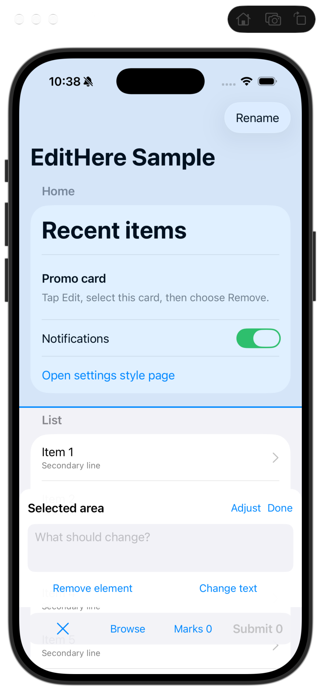

# EditHere native UI revision — review of the implemented redraw

Date: 2026-09-12. Reviewed source revision: `e78d45b`. This is a design handoff, not an implementation. It supersedes the previous handoff's custom layout study wherever they conflict. Preserve the earlier evidence, draft and submission requirements.

## User correction, recorded before further design

The user has seen the other Agent's implementation and rejects its engineering-demo appearance. Developer users deserve a highly polished interface. EditHere must be clearly distinguishable from the host application, with deliberate visual contrast. **Use native iOS UI components and native presentation structures; stop building custom imitations of toolbars and sheets.** No extra approval gate or recurring setup is introduced.

**2026-09-12 follow-up (authoritative, product knowledge base § System controls):** if a standard system control exists for the job, custom-drawing or hand-building a substitute is forbidden. This is not limited to toolbars and sheets. It includes lists, swipe-to-delete, empty states, buttons, menus, and alerts. The numbered outline on the frozen canvas remains the only allowed bespoke drawing.

**Ruling (2026-09-12):** Browse as a chrome control is superseded. Close already returns to the live app and keeps the batch. Ignore later “Browse where needed / Collapse/Browse” wording in this review.

The earlier three-state schematic is an interaction sketch, not an approved final aesthetic specification. Do not keep reproducing its manually drawn containers. This document and the user's newer correction take precedence for UI implementation. Before implementing, update the product knowledge base and the repository review's UI section so the old “accepted design” language cannot direct another redraw to the rejected composition.

## What I actually inspected

Launched the installed EditHereSample on iPhone 17 Simulator, iOS 26.2, and inspected the current selected-target/request-entry screen. Its visible structure matches the latest source. This is simulator evidence, not real-device acceptance or a binary-to-commit checksum proof.

The visible defects are specific:

1. The input region looks like another white host-app card. Its bottom-only relationship to the separate pale toolbar creates a stack of unrelated surfaces, with host list content visible in the gaps.
2. Adjust, Done, the two presets, Browse and Marks are mostly equally styled blue text. There is no clear hierarchy between “change target”, “finish typing”, “return to app” and “submit all”.
3. A large selected region is washed blue, competing with the editing UI and changing the appearance of the subject being inspected. Target marking and tool chrome do not have distinct visual jobs.
4. There is no clear EditHere identity at the moment of editing. “Selected area” alone reads as host-app content, not an independent annotation tool.
5. The composer is squeezed into a fixed height. Compactness has become compression: narrow spacing, a shallow text area and controls packed close to edges. More intentional spacing is needed, not a bigger collection of controls.

Source verification: `Sources/EditHere/UI/ComposerView.swift` uses `UIStackView` as the toolbar, a plain `UIView` as the write sheet, manual background alpha, corner radii and a fixed 168-point writing height. The buttons and text editor themselves are UIKit controls. Therefore the accurate diagnosis is **custom composition/presentation around native leaf controls**, not “everything is custom-drawn.” `HostWindow.swift` directly attaches this composition to the overlay. The Marks path already presents a navigation controller; retain that native foundation.

## Direction: a native editing surface above a clearly separate canvas

Use three visual roles, not three competing panels:

- **Host canvas:** the screenshot stays visually faithful and legible. It is the thing being edited, not the UI that performs editing.
- **Selection:** a precise outline and numbered badge. This is the only area where bespoke drawing is essential. Avoid flooding large regions with saturated translucent blue.
- **EditHere controls:** standard system presentation, an explicit concise title, native toolbars and menus, and one emphasized batch action. The system supplies material, elevation, insets, corners, gestures and motion.

Do not force a permanent dark theme or invert controls according to arbitrary screenshot pixels. Dark/light host pages must both be distinguishable through elevation, identity, spacing and system surface contrast. Glass alone does not guarantee text contrast. Do not layer manual blur/gradient/border decorations to “make it premium.”

## Concrete component replacement

| Current implementation | Required direction |
|---|---|
| Rounded `UIStackView` pretending to be a toolbar | Standard navigation-controller toolbar items / `UIToolbar` where no navigation controller owns it; system bar buttons and flexible spacing |
| Fixed-height plain `UIView` pretending to be a sheet | A presented view controller using system presentation; use a no-arrow popover with iPhone adaptive style `.none` when the composer must be a detached rounded rectangle |
| All controls as equally weighted blue text | Native action roles: Close as dismissal, **Quick Actions** as the request menu, `Done` to keep marking, and Submit as the one prominent batch action on Marks |
| Text editor surrounded by several custom rounded layers | Native multiline editor inside a standard content section, dynamic text and comfortable content insets; no bespoke rounded background nest |
| Custom modal edge, shadow or fake glass | System presentation appearance. On iOS 26 let standard containers adopt their appearance; use native older-OS fallback |
| Custom list cards for collected requests | Standard list/table in a navigation controller, native separators, editing/swipe actions and typography |

No framework rewrite is required. UIKit already provides these containers. Do not introduce SwiftUI merely to claim “native”; either framework is native when using actual standard presentation. Keep the SDK's state and destination contracts intact.

## Composition by moment

### 1. Enter and select

The floating entry uses a standard configured system button with an SF Symbol, proper hit area and accessible name; no manually painted blue disk/shadow. It disappears in annotation mode.

The annotation workspace has an explicit, compact `EditHere` identity in its system navigation structure and a visible Close action. Keep primary actions in native bars. **Superseded (2026-09-12):** Close is trailing / 靠右; Marks sits immediately to its left, titled `N Marks`. One leading flexible spacer. A second flexible spacer between Marks and Close is equal-width column layout, not tighter grouping. Do not restore Close leading with Marks on the opposite end. Appear/hide that bar with `UIToolbar.setItems(_:animated:)` rather than an instant `isHidden` flash (items must start empty; unhide first). Do not wrap the overlay in a navigation controller solely to get `setToolbarHidden` — idle hit-testing would steal host touches.

**User correction 2026-09-12:** Submit is not on the selection toolbar or the write sheet. Open Marks (the collected-edits list) to Submit the batch. The write sheet’s trailing action is Done, so the developer can keep marking.

Do not blur the canvas or push the gray scrim into night-mode territory (≥ 0.6 alpha): the developer must still judge the real pixels. **User correction 2026-09-12:** the original wash was too light; **0.40 was too dark**; **0.32 was still a bit dark**. Accepted: alpha **0.26**, Reduce Transparency **0.38**. Authority: product knowledge base. Draw a thin selected outline and a legible numbered badge. Any interior fill on the selection itself must stay extremely subtle; large selections should preferably have no fill. A selection covering most of the screen must still leave the screenshot readable. Keep semantic selection failures separate from the aesthetic change.

### 2. Select a target and write

Present a genuine system surface, anchored to the annotation workspace. Do not force a 168-point height. At large accessibility text sizes keep the same compact strip and let the request field scroll; do not grow the card toward the status bar.

**User correction 2026-09-12:** focusing the request field must keep a short strip above the software keyboard, matching a compact composer, not a half- or full-screen sheet and not a tall empty card. **Quick Actions** stays on that card’s own toolbar — trailing / 靠右, not centered, not glued to the keyboard. Visible title is **Quick Actions**, not **Actions**. **Marks is not on this card**; it is only on the selection-mode bottom bar. Tapping a target must open the keyboard immediately, and the card must **slide up with the keyboard at keyboard speed** — do not flash it in, and do not wait for a slower popover to finish. Do not add keyboard height into a custom detent. Do not select `.medium` or `.large` on first responder.

**Later ruling (same day):** a compact `pageSheet` still draws white down behind the keyboard, so the lower corners disappear. When four visible corners are required, use a **system popover** (no arrow; iPhone adaptive style `.none`). Do not fake a lower radius on leftover sheet chrome, and do not inflate the floating card to 16 pt sides / 32 pt bottom. Compact **8 pt** margins are the accepted proportion. Authority: product knowledge base. This supersedes “present a genuine system sheet” and “let the system choose its corner/edge treatment” in this section wherever they would restore a connected white slab.

Inside: title `EditHere`, one multiline request field, and a native **Quick Actions** menu for request shortcuts. Do **not** show `N · Selected area` (or any other target caption) as a subtitle or in-sheet label — the canvas outline already marks the target.

Suggested hierarchy:

- Navigation title `EditHere` only.
- Native Close/collapse action and a trailing **Done** action (keep marking). Do **not** put Submit here.
- Request editor with `What should change?` when empty.
- One secondary native menu, **Quick Actions**: a flat list with system symbols, **Change text** then **Remove element** (trash, destructive red). No `Request` / `Target` section titles.

**User correction 2026-09-12:** cut target adjustment from Actions. Do **not** include a Target group or `Larger area` / `Smaller area` / `Use point`. This supersedes the earlier “native menu for target adjustment/presets” and “target-boundary adjustments grouped separately” wording in this section. Same-point retap still walks ancestry; automatic point fallback remains when no useful bounds exist. Menu items must have system symbols; Remove uses `.destructive`.

**Done** finishes this mark: dismiss the keyboard and composer, keep any typed request, and return to the frozen canvas so another target can be selected. It is not a save gate and it does not submit the batch. Typed input remains automatically retained. Swipe-down and the collapse chevron share that same continue-marking path. Close on the selection toolbar still returns to the live app.

For the compact detached composer, configure the no-arrow system popover to claim its whole card and keep the **frozen annotation canvas** behind it from retargeting; never pass those touches to live host business controls. Do not use a page-sheet detent for this state: its white chrome extends behind the keyboard and removes the lower background gap. Do not additionally paint a second dimming layer. Done returns to the canvas naturally; Close returns to the live host.

Keep system-surface/keyboard layout under one owner. Verify host-keyboard dismissal before capture and focus restoration after the surface closes. Do not pin the request field to `keyboardLayoutGuide`. Compact popover sizing is **content height only** — do not add keyboard overlap, do not use `inputAccessoryView` for Actions, and do not select `.medium` / `.large`.

### 3. Review all marks, only when requested

Use the existing native navigation/list presentation. Title `N changes`, standard Close, grouped capture sections, actual request text and optional thumbnails. Use system row actions to edit/delete marks. **This is the only place Submit appears** — one emphasized native action for the whole batch. This list is optional for review, never an approval screen.

### 4. Return to the host

Dismiss the annotation presentation, restore the host's unmodified appearance and interaction, and restore the entry control. No SDK tint, dimming, disabled interaction or intercepted touches may remain. Evidence export contains the original full screenshot and required marks, not the system composer, dimming backdrop or toolbar.

## Native platform basis

Apple recommends standard UI components to adopt system appearance, and explicitly warns against custom toolbar backgrounds when the system presents Liquid Glass. When a navigation controller owns the interface, use its toolbar items to receive system transitions: [UIToolbar](https://developer.apple.com/documentation/uikit/uitoolbar), [Adopting Liquid Glass](https://developer.apple.com/documentation/TechnologyOverviews/adopting-liquid-glass).

Native sheets support detents, grabbers and background interaction: [UISheetPresentationController](https://developer.apple.com/documentation/uikit/uisheetpresentationcontroller). That API remains useful for a connected sheet variant, but it is not the accepted composer when four visible corners and a background gap are required. The accepted composer uses a [UIPopoverPresentationController](https://developer.apple.com/documentation/uikit/uipopoverpresentationcontroller) with no arrow and iPhone adaptive style `.none`; do not copy a sheet's edge treatment into that state.

## Implementation and visual acceptance

1. Replace the fake toolbar and fake presentation first. Preserve the existing request state and submission behavior. Remove manual background/corner/shadow overrides from system-owned containers.
2. Establish clear identity and a single primary action; move infrequent actions to native menus. Reduce large selection fills.
3. Capture the same target in the same sample page before/after. Inspect collapsed selection, editing with keyboard, optional mark list, and return-to-host states. The input popover must read immediately as an editing layer above the host, not another host card.
4. Repeat against a plain white app, a dark app and visually dense content, in system light/dark modes. Test Increase Contrast, Reduce Transparency, large text, smallest supported screen and iPad. Do not assume native components automatically solve every layout decision.
5. Verify selection behind the compact popover, all bottom-edge targets, no live-host accidental taps, no duplicate Submit, no obscured Close, no unsaved text, and clean exported screenshots.
6. Have a real running native UI screenshot assessed before declaring the aesthetic redesign finished. Another schematic or successful build is insufficient.

This pass changes temporary review documents only. No product UI implementation or renewed functional acceptance is claimed.
